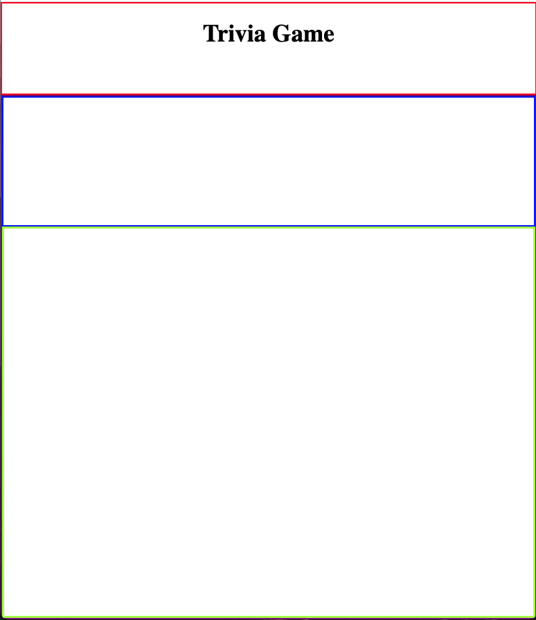
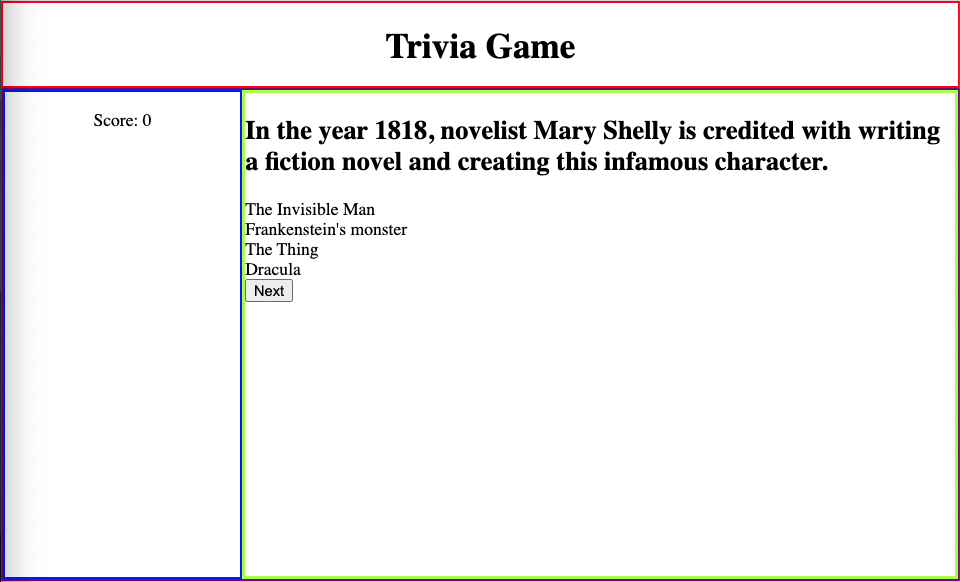

# Trivia Game Walkthrough

### This repo will take you through building a Trivia Game using an API from which we can fetch questions.

#### We'll build this for mobile-first and then add a media query to handle larger screens

#### The steps are laid out and there are `Spoilers` that are hidden, but can be opened incase you need a hint.

1. Start by creating your `index.html` and adding your boilerplate w `! tab`.
    <details>
    <summary>Spoiler</summary>

    ```html
    <!DOCTYPE html>
    <html lang="en">
    <head>
        <meta charset="UTF-8">
        <meta http-equiv="X-UA-Compatible" content="IE=edge">
        <meta name="viewport" content="width=device-width, initial-scale=1.0">
        <title>Document</title>
    </head>
    <body>
        
    </body>
    </html>
    ```
    </details>
    <br/>

2. Then create your `style.css` and `main.js` and link them to your `index.html`.
    <details>
    <summary>Spoiler</summary>

    ```html
    <!-- Inside of the <head> tag -->
    <link rel="stylesheet" href="./style.css">
    <script defer src="./main.js"></script>
    ```
    </details>
    <br/>

3. Next, start by creating your layout. We're going to have `two` sections: a `header` tag and a `main` tag.
    <details>
    <summary>Spoiler</summary>

    ```html
    <!-- Inside the <body> tag -->
    <header></header>
    <main></main>
    ```
    </details>
    <br/>

4. Let's go over to our CSS so we can visualize this a bit. In your CSS file apply these styles:
    - Give `*` a `box-sizing` of `border-box`.
    - Give the `body` a `margin` of 0.
    - Give the `header` a height of `15vh` and a `border` of `2px solid red`.
    - Give the `main` a height of `85vh` and a `border` of `2px solid purple`.

The overall layout is pretty simple and now that we can see our sections, we can start adding to each of them :muscle:

5. Inside of your `header`, add an `h1`. Add the text `Trivia Game`. Use CSS to center it.
    <details>
    <summary>Spoiler</summary>

    ```html
    <!-- Inside of the <header> tag -->
    <header>
        <h1>Trivia Game</h1>
    </header>
    ```
    </details>
    <br/>

6. Inside of your `main`, add **two** tags: a `div` w the class of *scoreboard*, and a `div` w the class of *questions*
    <details>
    <summary>Spoiler</summary>

    ```html
    <main>
        <div class="scoreboard"></div>
        <div class="questions"></div>
    </main>
    ```
    </details>
    <br/>
    

7. Make your main area into a grid w two rows on a small screen, but two columns on a larger screen.
    - In CSS, give the `main` a `display` of `grid`
    - Use `grid-template-rows` to create two rows w sizes: `1fr 6fr`.
    - Grab each `div` in the main tag and give it a `border` of `2px solid any-color`. Make sure you do it for both.
    - For the `div` w the class of `scoreboard`, give it a display of `grid` and `align-items` `center`
    <details>
    <summary>Spoiler</summary>

    ```css
    main {
        height: 85vh;
        border: 2px solid purple;
        display: grid;
        grid-template-rows: 1fr 6fr;
    }
    .scoreboard {
        border: 2px solid blue;
    }

    .questions {
        border: 3px solid greenyellow;
        text-align: center;
    }
    ```
    </details>
    <br/>

At this point you should see three rows on your page like the sceenshot below:



8. Now add a media query to change the grid from two rows, to two columns.
    - Add a media query that will update the styles for the `main` when the screen `width` is greater than `768px`.
    - 8b: change the value for `grid-template-rows` to be `1fr`.
    - 8c: add `grid-template-columns` and give it two columns w sizes: `1fr 3fr`.
    <details>
    <summary>Spoiler</summary>

    ```css
    @media (min-width: 768px){
        main {
            grid-template-columns: 1fr 3fr;
            grid-template-rows: 1fr;
        }
    }
    ```
    </details>
    <br/>

Awesome! Now when we resize our screen, we should see it change between `three rows` and `two rows, with two columns within the second row`.

Now let's break down the `scoreboard` and the `questions` areas.

9. Inside the `div` w the class of `scoreboard`, add a `p` tag and give it the inner text of `Score: `.
    - Also go into your CSS and align the text inside the `p` tage to be centered.
    <details>
    <summary>Spoiler</summary>

    ```html
    <div class="scoreboard">
        <p>Score: </p>
    </div>
    ```
    </details>
    <br/>

10. Inside the `p` tag, after the text, add a `span` that has the class of `score`. This will be the tag we update via JS when a user gets the question correct. Give the span the text of `0`.
    <details>
    <summary>Spoiler</summary>

    ```html
    <div class="scoreboard">
        <p>Score: <span class="score">0</span></p>
    </div>
    ```
    </details>
    <br/>

11. Now for the `questions` area:
    - Let's add an `h2` inside and give it an `id` of `question`.
    - Then add a `div` w the `id` of `answers`.
    - Lastly, add a `button` w the `id` of `next` and give it the inner text of `Next`
    <details>
    <summary>Spoiler</summary>

    ```html
    <div class="questions">
        <h2 id="question"></h2>
        <div id="answers"></div>
        <button id="next">Next</button>
    </div>
    ```
    </details>
    <br/>

Great, now that we have the basic layout for our game, we can start populating it w questions and answers!

12. First, we need some questions for our game. Go to the [Trivia API](https://opentdb.com/api_config.php) and read the instructions to generate a URL endpoint for your game.
    - Make sure under `Select Type` you select `Multiple Choice`
    - Do NOT change the bottom dropdown that says `Select Encoding`
    <details>
    <summary>Spoiler</summary>

    ```js
    Sample URL: `https://opentdb.com/api.php?amount=10&category=10&type=multiple`
    ```
    </details>
    <br/>


Now that you have the URL endpoint for the Trivia API, we can use it to populate our page and make our game functional.

13. In your `main.js` file write a function called `getQuestions`
    - Inside of the function, make a `fetch` request to the URL you got in Step 12.
    - Confirm you got the correct data inside of the console.
    <details>
    <summary>Spoiler</summary>

    ```js
    // Using async await
    const qs = await fetch(`https://opentdb.com/api.php?amount=10&category=10&type=multiple`)
    const qsJson = await qs.json()
    console.log(qsJson)


    // OR


    // Using promise chain
    fetch(`https://opentdb.com/api.php?amount=10&category=10&type=multiple`)
        .then(res => res.json())
        .then(res => { console.log(res) })
        .catch(err => console.log(err))
    ```
    </details>
    <br/>

Awesome! Now we have some data to work with. By looking at the `results` key in our response, we can see the array of objects we're going to use. The keys we care about in each object are: `question`, `correct_answer`, `incorrect_answers`

Take a minute to look over the keys we're using.
We can see that there's the `correct_answer` and three strings in `incorrect_answers`.

We can create a new array and add the `correct_answer` to the `incorrect_answers` for each question.

Then when a user clicks on the answer they've selected, we can compare it to the `correct_answer` for that question.

14. First, create a new array by mapping over the results:
    - Use `map()` to iterate over the results and update a variable called `updatedResults` (declare this variable at the top of the page, in the global scope)
    - Inside of each map, `push()` the `correct_answer` to the array of `incorrect_answers`
    <details>
    <summary>Spoiler</summary>

    ```js
    const results = qsJson.results
    updatedResults = results.map(q => {
        q.incorrect_answers.push(q.correct_answer)
        return q
    })
    ```
    </details>
    <br/>

Now that we've manipulated the data so the `correct_answer` is in the array of `incorrect_answers` we can populate the `question` and `answers` elements.

15. Let's grab the elements w the IDs `question`, `answers`, and `next` and save them to variables called `question` and `answers`, `next` respectively.
    - Also initialize a variable called `index` to `0`. This value will serve as the index for our current question.
    <details>
    <summary>Spoiler</summary>

    ```js
    const question = document.querySelector('#question')
    const answers = document.querySelector('#answers')
    let index = 0
    let updatedResults;
    ```
    </details>
    <br/>

16. Next, assign the `innerHTML` of the `question` variable to be the value of the key `question` of the first object in the `updatedResults` array.
    <details>
    <summary>Spoiler</summary>

    ```js
    question.innerHTML = updatedResults[index].question
    ```
    </details>
    <br/>

This next part will shuffle our answer bank so the answers come out in random order

17. Write a `for` loop that starts at `0`, goes while `i < 4`, and increments by `1`.
    <details>
    <summary>Spoiler</summary>

    ```js
    for (let i = 0; i < 4; i++) {

    }
    ```
    </details>
    <br/>

The idea inside the for loop is to create an element for each answer, get a random index inside the `incorrect_answers` array, take that random index out of the `incorrect_answers` array and set it to the `innerHTML` of each of the elements we created.

18. Inside the for loop:
    - Create a div and save it to a variable called `div`
    - Create a variable called `randomNum`, and use `Math.floor()` and `Math.random()` to get a number between zero and the last index of the `incorrect_answers` array.
    - Set the `innerHTML` of the `div` to the randomly chosen answer out of the `incorrect_answers` array for the first object in the `updatedResults` array. (Hint: use splice() to take out the random index, one at a time)
    - Append the `div` to the `answers` element
    <details>
    <summary>Spoiler</summary>

    ```js
    for (let i = 0; i < 4; i++) {
        const div = document.createElement('div')
        const randomNum = Math.floor(Math.random() * updatedResults[index].incorrect_answers.length)
        div.innerHTML = updatedResults[index].incorrect_answers.splice(randomNum, 1)
        answers.append(div)
    } 
    ```
    </details>
    <br/>


At this point your app should display the information we need and your page should look like this on a wider screen size.



19. Next, in the `global scope`, add an event listener to the `next` button so that it goes to the next question we when click it:
    - Add event listener to `next`
    - Inside the callback function increment `index` by 1.
    - Then clear out the answer bay by updating its inner HTML to an empty string
    - Update the inner text of the `question` to be the next question in the array of `updatedResults`
    - Finally copy the `for` loop that you wrote in the previous step and paste it inside of the callback.
    <details>
    <summary>Spoiler</summary>

    ```js
    next.addEventListener('click', () => {
        // Increment the index to move to next question
        index++
        // Clear out the answer bay && question
        answers.innerHTML = ''
        // Update the question to the current index
        question.innerHTML = updatedResults[index].question
        // Repopulate the answer bay
        for (let i = 0; i < 4; i++) {
            const div = document.createElement('div')
            const randomNum = Math.floor(Math.random() * updatedResults[index].incorrect_answers.length)
            div.innerHTML = updatedResults[index].incorrect_answers.splice(randomNum, 1)
            answers.append(div)
        }  
    })
    ```
    </details>
    <br/>

20. **Optional Refactoring**:
    - Instead of having repeating code inside of two separate functions, we can write another function and just call it wherever we need.
    - Take the repeating code that we just copied from `getQuestions` and let's write a new function called `updateQuestion` and place the code in there.
    <details>
    <summary>Spoiler</summary>

    ```js
    const updateQuestion = () => {
    question.innerHTML = updatedResults[index].question 
    for (let i = 0; i < 4; i++) {
        const div = document.createElement('div')
        const randomNum = Math.floor(Math.random() * updatedResults[index].incorrect_answers.length)
        div.innerHTML = updatedResults[index].incorrect_answers.splice(randomNum, 1)
        answers.append(div)
    }  

    const getQuestions = async () => {
        // ... rest of the function

        updateQuestion()
    }

    next.addEventListener('click', () => {
        index++
        answers.innerHTML = ''
        updateQuestion()
    })
    ```
    </details>
    <br/>

21. Now that we have the basic functionality of our game working, less style it a bit more so it looks more appealing:
    - Center the text in element w the `id` of `question` using text-align and put a border of `2px solid brown` around it.
    - On the element w the `id` of `answers`, add the following:
        - A border of `2px solid orange`.
        - Set the height to 60%.
        - A display of `grid` w `2 columns` and `2 rows`
    - On the `divs` inside the element w the `id` of `answers`, add the following:
        - A border of `2px solid red`
        - A display of `grid`.
        - Use `align-content` and `justify-content` to center the text horizontally & vertically.
        - Use the `hover `pseudoselector to change the `background-color` to `aqua` and the `color` to `blueviolet`, and the `cursor` to `pointer`
    - On the element w the `class` of `questions` center the text to move the `button` to the middle.
    <details>
    <summary>Spoiler</summary>

    ```css
    .questions {
        border: 3px solid greenyellow;
        text-align: center;
    }

    #question {
        text-align: center;
        border: 2px solid brown;
    }

    #answers {
        border: 2px solid orange;
        height: 60%;
        display: grid;
        grid-template-columns: 1fr 1fr;
        grid-template-rows: 1fr 1fr;
    }

    #answers div {
        border: 2px solid red;
        display: grid;
        align-content: center;
    }

    #answers div:hover {
        background-color: aqua;
        color: blueviolet;
        cursor: pointer;
    }
    ```
    </details>
    <br/>

Our app is starting to come together now. Let's add functionality so when we click on one of the answers, we change the border to green if its correct, and red if it's incorrect. If its correct, then we will also update the score!


22. Add an event listener to the `answers` element and console .log the event object.
    - Examine the target any time you click in the box. What properties from the target can you use to see if you have the correct answer?
    <details>
    <summary>Spoiler</summary>

    ```js
    answers.addEventListener('click', (e) => {
        console.log(e)
    })
    ```
    </details>
    <br/>

23. Inside the event listener, write a conditional that checks whether the `innerHTML` of the target is equal to the current question's correct answer.
    - If it is:
        - Update the target's `backgroundColor` to `#00E35F`
        - Update the target's `border` to `2px solid green`
        - Increment the `score` variable by `10`
        - Update the `scoreSpan` element to have `score` as the inner text
    - If it isn't:
        - Update the target's backgroundColor to `#E30049`
        - Update the target's border to `#880000`
    - After the conditional, update the `answers` `pointerEvents` style property to `none` so it is not clickable after the first time we click it.
    <details>
    <summary>Spoiler</summary>

    ```js
    answers.addEventListener('click', (e) => {
        if(e.target.innerHTML === updatedResults[index].correct_answer){
            e.target.style.backgroundColor = `#00E35F`
            e.target.style.border = `2px solid green`
            score += 10
            scoreSpan.innerText = score

        } else {
            e.target.style.backgroundColor = '#E30049'
            e.target.style.border = `2px solid #880000`
        }
        answers.style.pointerEvents = 'none'
    })
    ```
    </details>
    <br/>

24. Also update the event listener on `next` to set the `answers` `pointerEvents` style property to `auto` so when we go to the next question, the answers are clickable again.
    <details>
    <summary>Spoiler</summary>

    ```js
    next.addEventListener('click', () => {
    // Increment the index to move to next question
    index++
    // Clear out the answer bay && question
    answers.innerHTML = ''
    // Update the question and answers
    updateQuestion()

    // Make the answers element clickable
    answers.style.pointerEvents = 'auto'
    
    })
    ```
    </details>
    <br/>

25. Lastly, update the event listener on `next` one more time so that after it increments `index`, it checks to see if we are out of questions.
    <details>
    <summary>Spoiler</summary>

    ```js
    next.addEventListener('click', () => {
        // Increment the index to move to next question
        index++

        if(index === updatedResults.length){
            question.innerHTML = "GAMEOVER"
            
        }
        // Clear out the answer bay && question
        answers.innerHTML = ''
        // Update the question and answers
        updateQuestion()

        // Make the answers element clickable
        answers.style.pointerEvents = 'auto'  
    })
    ```
    </details>
    <br/>

**This is where you take over :sunglasses:**

        

You now have a fully functioning project, but there's a long way to go to make this much better. Some things you can add:

- more CSS
- add a theme
- a custom font
- a play again button
- an end-game modal
- animations using animate.css
- different points for harder questions
- buttons to go back and forth between questions
   
    